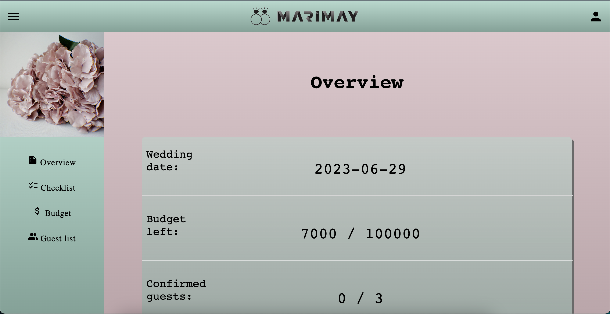
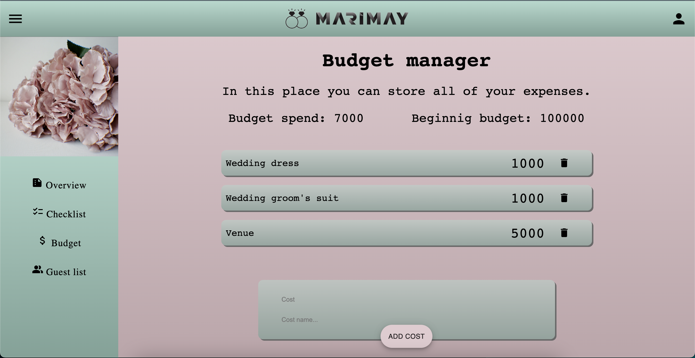
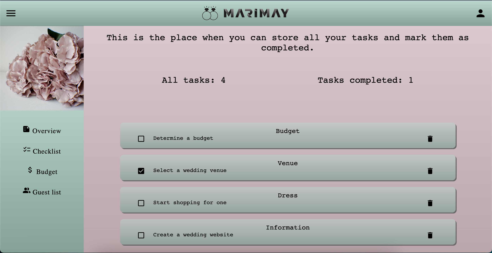
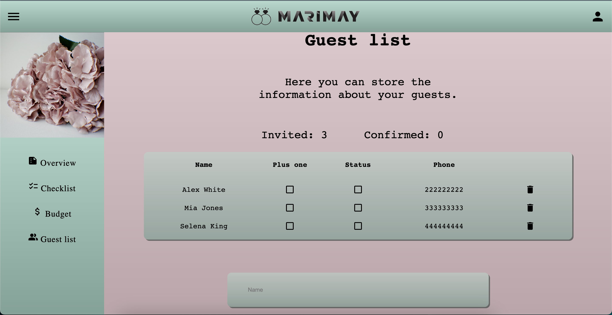
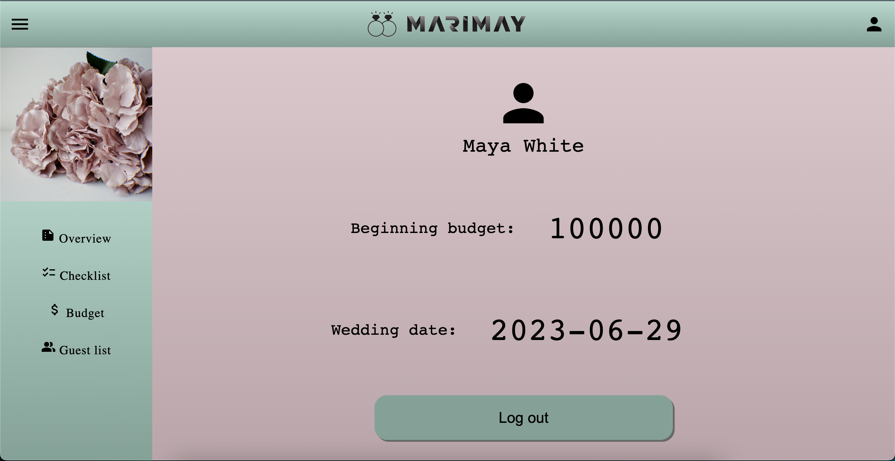

#Marimay

>Website that will help you plan a wedding.

## Table of contents

* [About website](#about-website)
* [Technologies Used](#technologies-used)
* [Features](#features)
* [Screenshots](#screenshots)

## About website

This website will allow you to wisely manage your wedding budget, calculate all the expenses. 
The checklists will keep track of all the things you will have to do in a future, and check the tasks that have been taken care of. 
You can store information about your guests, if they have a plus one, if they confirmed attendance.

## Technologies Used

- HTML
- CSS
- JS
- ReactJS
- PostgreSQL
- Git
- Java
- Spring-boot
- Hibernate 

## Features

These are the most important features:

- The user can set their budget and wedding date or update it
- The user can add new tasks to the checklist, mark them as completed, delete them
- The user can add new guests to their list, mark guest's status as confirmed, add a plus one to a guest, delete a guest
- The user can add new budget item and its cost as well as delete it

## Screenshots
There are some screenshots.

